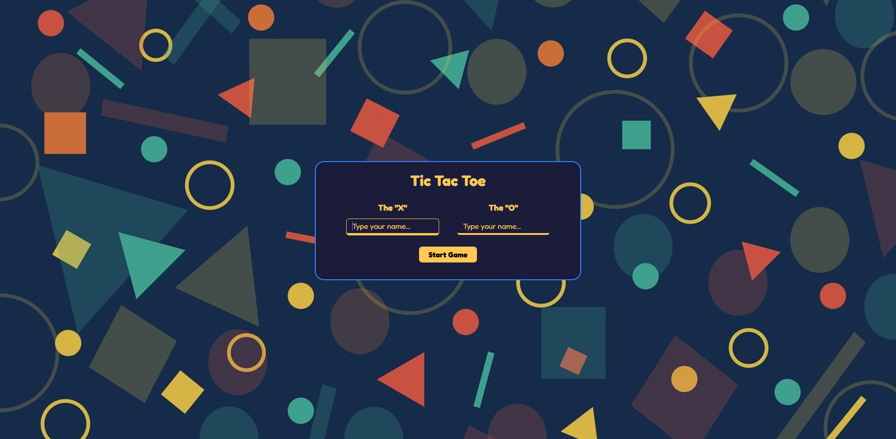
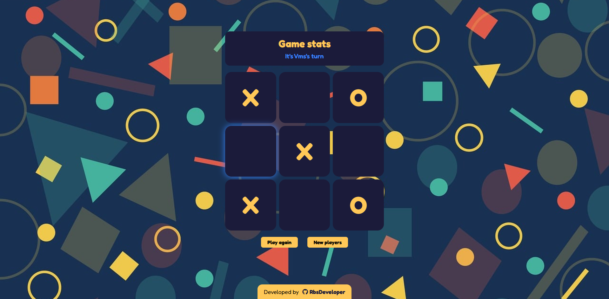

# Tic-Tac-Toe Game

A simple yet interactive Tic-Tac-Toe game built using **HTML, CSS, and JavaScript**. This project features a modern UI, smooth game mechanics, and a dynamic message display for player turns and results.

## Live Demo 🚀  
🔗 [View the Live Version](https://rbsdeveloper.github.io/TicTacToe-OdinProject/)

## 🚀 Features

- 🎮 **Two-Player Mode**: Players take turns placing their marks (X or O).
- 🎨 **Modern UI**: Designed with a clean and aesthetic layout.
- 🏆 **Winner Display**: Shows the winner or announces a tie.
- 🔄 **Restart & New Players**: Options to reset the board or start with new player names.
- 🎭 **Dialog-Based Start**: Players enter names via a modal before starting the game.
- ❌ **Click Feedback**: Visual feedback when clicking on an occupied cell.

---

## 🛠️ Installation & Usage

1. **Clone the repository**:
   ```sh
   git clone https://github.com/your-username/tic-tac-toe.git
   ```
2. **Navigate to the project folder**:
   ```sh
   cd tic-tac-toe
   ```
3. **Open `index.html` in your browser**.

---

## 🎮 How to Play

1. Enter player names in the **modal dialog** and click **Start Game**.
2. Click on an empty cell to place your mark.
3. The game alternates turns between players.
4. The game announces a winner or a tie.
5. Click **Reset Game** to play again or **New Players** to start fresh.

---

## 📜 MIT License

This project is licensed under the **MIT License** – you are free to use, modify, and distribute it.

---

## 🙌 Acknowledgments

- Inspired by classic Tic-Tac-Toe games.
- Developed by **[RbsDeveloper](https://github.com/RbsDeveloper)**.

---

## 📸 Screenshots

  
  

---

### 🎯 Future Improvements

- AI mode for single-player gameplay.
- Enhanced animations and sound effects.
- Mobile responsiveness improvements.

Enjoy playing! 🎉